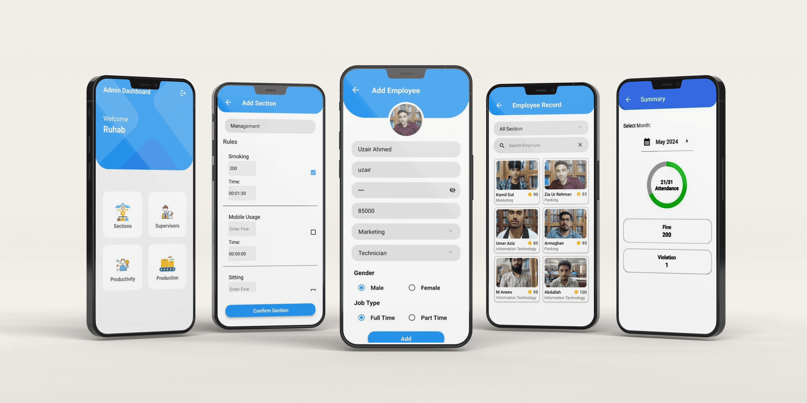
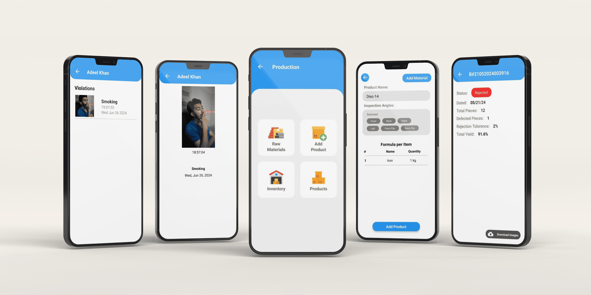
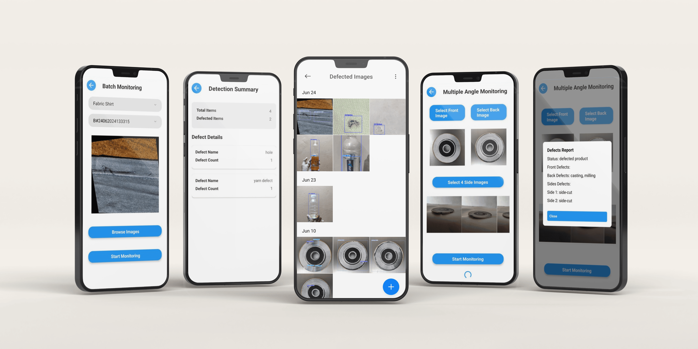

# Industrial Watch Backend

## Overview
Industrial Watch is a comprehensive AI-based monitoring system designed to enhance workplace efficiency and product quality in industrial settings. This project employs advanced AI technologies to monitor employee performance and detect defective products, ensuring compliance with workplace rules and maintaining high standards of production quality.

## Features

### Employee Performance Monitoring
Our system leverages AI camera monitoring to track and evaluate employee activities based on specific rules and criteria:

- **Cigarette Detection**: Monitors and detects smoking within the workplace. Violations are logged, and fines are imposed based on predefined rules.
- **Mobile Usage Detection**: Identifies unauthorized mobile phone usage during working hours. Incidents are recorded, and penalties are applied according to the established regulations.
- **Posture Detection**: Ensures employees are adhering to posture guidelines. Any breaches are documented, and appropriate fines are administered.

Each of these modules operates with distinct rules and fine structures to ensure compliance and promote a disciplined working environment.

### Defective Product Detection
Our AI models are trained to identify defects in various products, ensuring only high-quality items proceed through the production line. The modules include:

- **Centrifugal Discs**: Detects imperfections and anomalies in centrifugal discs, ensuring they meet the required standards.
- **Water Bottles**: Monitors water bottles for defects such as missing cap or label, maintaining product integrity.
- **Textile Defects**: Identifies issues in textile products, such as thread inconsistencies, and fabric damage.

## Technology Stack
- **Backend**: Python
- **AI Models**: YOLOv8, PyTorch
- **Database**: SQL Server
## Front-end Integration
This project is a group effort with multiple front-end implementations to ensure compatibility across various platforms. The front-ends are developed using:
- **Android**: Native Android application.
- **React Native**: For seamless mobile application interface.
- **Flutter**: Cross-platform mobile application.
- **iOS**: Native iOS application.
## Installation and Setup

Requires Python 3.11, Docker, and the Microsoft ODBC Driver 18 for SQL Server
(`brew install msodbcsql18` on macOS).

1. Start SQL Server in Docker:
    ```bash
    docker run -d --name industrialwatch-sql -e ACCEPT_EULA=Y \
      -e 'MSSQL_SA_PASSWORD=<your-password>' -p 1433:1433 \
      mcr.microsoft.com/mssql/server:2022-latest
    ```

2. Create the schema and seed data (rules, job roles, `admin`/`admin` login):
    ```bash
    SQLCMD="docker exec -i industrialwatch-sql /opt/mssql-tools18/bin/sqlcmd -S localhost -U sa -P <your-password> -C"
    $SQLCMD < "Database Script" && $SQLCMD < seed.sql
    ```

3. Configure environment variables:
    ```bash
    cp .env.example .env   # then set DB_PASSWORD
    ```

4. Install Python dependencies:
    ```bash
    python3.11 -m venv .venv
    .venv/bin/pip install -r requirements.txt
    ```

5. Start the server (listens on port 5000):
    ```bash
    .venv/bin/python route.py
    ```

### Model files
`trained_models/` needs `disk_model.pt`, `mobile_detection.pt`, `cigarette_detection.pt`,
`bottle_defect.pt`, `textile_defect_detection.pt` and `side_cut_model.pt`. The last three
were never committed to git, so bottle, textile and multi-angle defect detection won't work without them.

## Contact
For any inquiries or support, please contact [abdullahmustafa3607@gmail.com] or [usama.fayyaz157@gmail.com].


<div style="border-radius: 10px; overflow: hidden; width: fit-content;">
  
</div>
<div style="border-radius: 10px; overflow: hidden; width: fit-content;">
  
</div>
<div style="border-radius: 10px; overflow: hidden; width: fit-content;">
  
</div>
